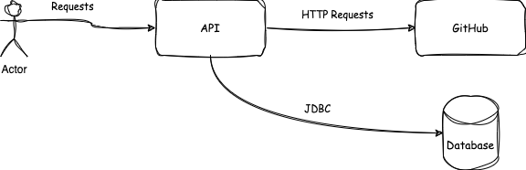

# Spring JDBC POC

This is a simple Spring JDBC POC to demonstrate how to use Spring JDBC to connect to a database and perform CRUD operations. 
It is also doing http request to get data from a public API and store it in the database. The public API used in this POC is 
the github public api.

## Project Layers

The project is divided in 3 layers:
- Controller: This layer is responsible for receiving the http requests and calling the service layer.
- Service: This layer is responsible for the business logic.
- Repository: This layer is responsible for the database operations.
- Domain: This layer is responsible for the data model.
- Exception: This layer is responsible for the exceptions.

## Technologies

- Spring Boot
- Java 17
- FeignClient (to consume the public API)

## Architecture And Use Cases
This api allows the user to search for a github user by its username and store it in the database. 
After the first request to a specific username, the next requests will return the data from the database.
It is also possible to delete a user from the database by its username.

## Endpoints

- GET `/{username}` - Search for a github user by its username and store it in the database.
- DELETE `/internal/{username}` - Delete a user from the database by its username.
- GET `/internal/{username}` - Get all the repositories from a user by its username.

## Tests

Unit tests were implemented for the service layer. Integrated tests will be implemented in the future.

